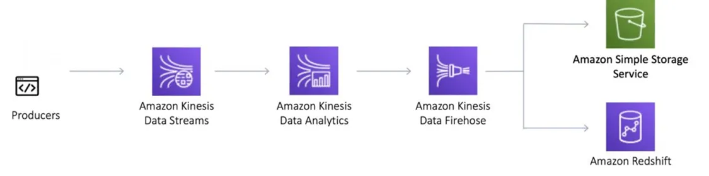
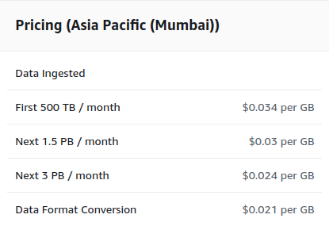

# AWS Kinesis

The ability to ingest, process, and analyze real-time data enables companies to make quick data-driven decisions and react rapidly to changes. In we will look at how to implement a real-time streaming data pipeline using Amazon Kinesis.

## Overview of AWS Kinesis

`Amazon Kinesis` is a managed service provided by AWS for real-time data streaming. Kinesis provides capabilities to continuously capture and store terabytes of data per hour from hundreds of thousands of sources. The data can then be processed and analyzed in `real-time`.

## The main components of Kinesis are:

- `Kinesis Data Streams` — For ingesting `real-time` data from many sources. Data is stored in shards and retained for 24 hours by default.
- `Kinesis Data Firehose` — For loading streamed data into AWS data stores and analytics tools. It can capture, transform, and load data.
- `Kinesis Data Analytics` — For running SQL or `Apache Flink` code on streaming data to perform real-time analytics.

# Architecture for Real-time Streaming with Kinesis

A typical architecture for real-time data streaming and processing with Kinesis involves:

- `Data Producers` — Various data sources producing real-time data that needs to be ingested. This could include IoT devices, web/mobile apps, etc.
- `Kinesis Data Streams` — Ingests and stores incoming streams of data in shards. Acts as the source for streaming data.
- `Kinesis Data Firehose` — Loads the streaming data into S3, Redshift, Elasticsearch etc. for storage and analysis.
- `Kinesis Data Analytics` — Runs analytics code on the streaming data to generate real-time insights and metrics.
- `Dashboards and Visualization` — Consumes the analytics output and generated metrics to present real-time dashboards and visualizations.

## Benefits and features

- `No-code`

Create a Firehose stream, select your source and destination, specify your transformation, and start streaming real-time data with just a few clicks without writing a code.

- `Built-in transformations`

Transform your data streams into formats like Parquet and ORC, and dynamically partition data to write to the Amazon S3 destination bucket with different S3 prefixes using metadata attributes.

- `Serverless`

Automatically provision and scale compute, memory, and network resources without ongoing administration.

- `Multiple sources and destinations`

Built-in support for 25+ sources and destinations such as Amazon S3, Amazon Redshift, Amazon OpenSearch Service, Splunk, and Snowflake.

## Pricing (Asia Pacific (Mumbai))

